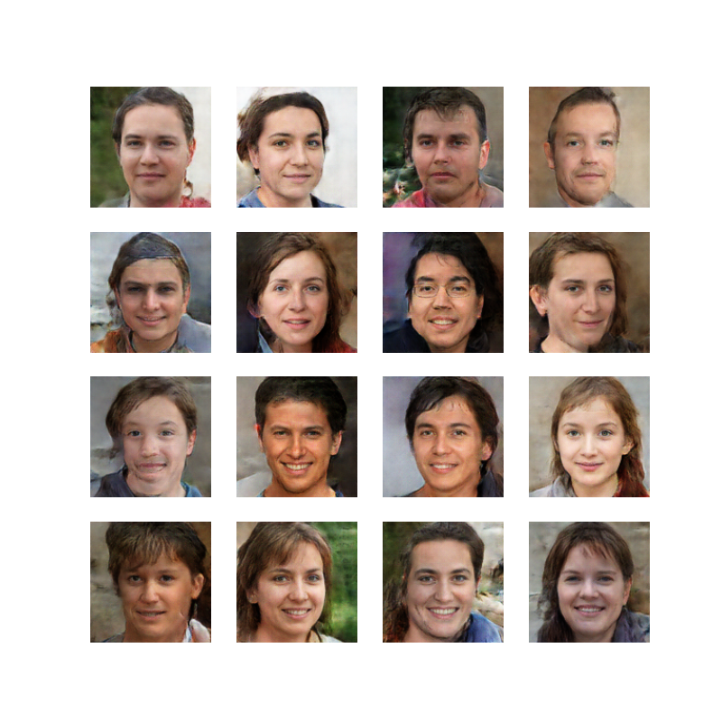

# AI Face Generator using a Deep Convolutional GAN (DCGAN)

## Try the App Demo here: [DEMO](https://dcgan-fake-face-generator.streamlit.app/)
---

## Project Overview
This project is a deep learning model that generates unique, artificial human faces. It implements a **Deep Convolutional Generative Adversarial Network (DCGAN)** from scratch using TensorFlow and Keras. The model was trained for **800 epochs** on a Google TPU v3-8 to learn coherent facial structures from a dataset of real images.

The project showcases a complete, end-to-end machine learning workflow, from data loading and preprocessing to building the competing Generator and Discriminator models, executing a long-form training session, and deploying the final model in an interactive web application built with Streamlit.

---

## Final Result
Final Result of the model after 800 epochs



---

## Key Features
* **Generative Model**: Implements a DCGAN from scratch to create new, non-existent human faces at a 128x128 resolution.

* **High-Speed Training**: Leveraged a Google TPU v3-8 for accelerated training, reducing epoch times from many minutes to just a few seconds, making an extended 800+ epoch training run feasible.

* **Advanced Training Techniques**: The training process incorporates proven strategies like the Two Time-Scale Update Rule (TTUR) and Discriminator Noise to stabilize training and improve image quality.

* **Interactive Application**: A user-friendly web app built with Streamlit that allows for real-time generation of new faces, providing an engaging way to interact with the final model.

* **End-to-End Project**: Covers the full workflow from data loading and model building to training, debugging, and final deployment in a web app.

---

## The Journey: Building a Stable GAN
This project followed a deliberate, iterative process to build a stable and effective generative model.

1.  **Baseline Model & Training:** An initial DCGAN was built and trained for ~75 epochs. This was enough to prove that the model could learn the basic structure of a face, but the results were often blurry and "disoriented."

2.  **Diagnosis:** Simply increasing the training duration to 700+ epochs improved results but did not fully solve the problem of disoriented images. This indicated that the training dynamic itself had become unproductive, with the Generator and Discriminator locked in a repetitive, stale "argument."

3.  **Solution & Advanced Iteration:** To break this stalemate, the training process was upgraded with two key techniques:
    * **Two Time-Scale Update Rule (TTUR):** The Discriminator was given a faster learning rate than the Generator, making its feedback more relevant and forcing the Generator to make more meaningful improvements.
    * **Discriminator Noise:** A `GaussianNoise` layer was added to the Discriminator's input to prevent it from overfitting and encourage it to learn more robust, general features of what makes a face look real.

4.  **Final Results:** This iterative process was highly successful, leading to a final model capable of generating a higher proportion of coherent and well-structured faces.

---

## Dataset
The model was trained on the **Face Mask Lite Dataset** from Kaggle. To focus on generating standard faces, only the `without_mask` subset was used, which contains over 9,000 images of human faces. This high-quality dataset was essential for training the model effectively.

---

## Technologies Used
* **Python**
* **TensorFlow & Keras** for model building and training
* **Streamlit** for the interactive web application
* **NumPy & Pillow** for data and image manipulation
* **Matplotlib** for data visualization
* **Kaggle Notebooks & TPUs** for the training environment

---

## Running the Interactive Demo
The interactive Streamlit application can be run on your local machine.

### Local Setup Instructions
To run the application, please follow these steps:
```bash
# 1. Clone the repository
git clone [https://github.com/your-username/ai-face-generator.git](https://github.com/your-username/ai-face-generator.git)
cd ai-face-generator

# 2. Install the required dependencies
pip install -r requirements.txt

# 3. Download the model file (see section below) and place it in the `model/` folder.

# 4. Run the Streamlit app
streamlit run app.py
```

## Project Files
`app.py`: The Python script for the Streamlit web application.

`dcgan_fake_face_generator.ipynb`: The complete, annotated Jupyter Notebook with the data processing, model training, and evaluation process.

`requirements.txt`: A list of necessary Python packages for reproducibility.

`face_generator_model.h5`: The final, trained Keras generator model.

## Model & Dataset Source
### Model
The trained model file (`face_generator_model.h5`) is the direct output of the training notebook. The notebook can be used to retrain the model from scratch.

* **Training Notebook**: [AI Face Generator on Kaggle](https://www.kaggle.com/code/msarvesh2k6/dcgan-fake-face-generator)

### Dataset
This project utilizes the Face Mask Lite Dataset, sourced from Kaggle. Proper credit goes to the original creator of the dataset.

* **Source**: [Face Mask Lite Dataset on Kaggle](https://www.kaggle.com/datasets/prasoonkottarathil/face-mask-lite-dataset)

* **License**: MIT


